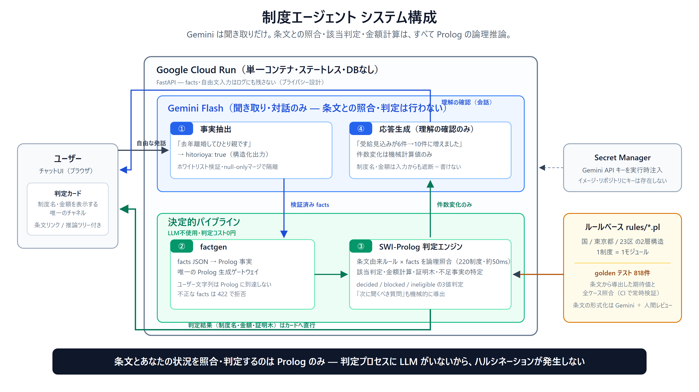

# 制度エージェント（seido-agent）

> あなたが貰い損ねているお金を、根拠付きで見つける

**DevOps × AI Agent Hackathon 2026** 提出プロジェクト

## 30秒でわかる seido-agent

**デモ**: https://seido-agent-585188533335.asia-northeast1.run.app ／ **デモ動画**: `<動画URL — 公開後に差し替え>`

1. お住まいの区と生年月日・家族構成を選ぶ（チップをタップするだけ）
2. AIが「判定が進む質問」だけを選んで聞いてくる — 全制度を毎回一括再判定（1回 約0.5秒）
3. 「実は去年離婚してひとり親です」のように**自由に話しても伝わる** — Gemini が発話から事実を抽出し、判定そのものは Prolog だけが行う
4. 「受給見込み」の制度ごとに **金額・該当理由・条文リンク・Prolog推論ツリー** を確認できる

| 数値 | 値 |
|---|---|
| 収録制度 | **220制度**（国79 + 東京都・23区）※golden検証済みのみ公開 |
| 対応自治体 | 東京23区 |
| 判定の正しさの担保 | **goldenテスト818件**（条文から導出した期待値と全ケース照合） |
| 判定へのLLM関与 | **ゼロ**（判定はSWI-Prologのみ。ハルシネーション構造的に不可能） |

| 技術スタック | 用途 |
|---|---|
| Gemini Flash | 対話からの事実抽出・応答生成（判定はしない） |
| SWI-Prolog | 全制度の該当判定・証明木生成・不足事実の特定 |
| FastAPI | ステートレスAPI（DBなし・入力情報は保存しない） |
| Cloud Run | 単一コンテナ（swipl同梱）でのサーバーレス実行 |



## 課題

日本の社会保障・補助金制度は**申請主義**。ルールを知らない人は、本来受け取れる給付を黙って取りこぼし続ける。

- 制度は数千種類、要件は多段の条件分岐（「年収X以下 かつ 世帯構成Y、ただしZの場合を除く」）
- 生活保護基準未満の世帯のうち実際に保護を受けているのは、所得のみの比較で**2割前後**（[厚生労働省の「保護世帯比」推計](https://www.mhlw.go.jp/stf/houdou/2r98520000005olm-img/2r98520000005oof.pdf)。厚労省自身は受給要件の完全な判定は統計上不可能として「捕捉率」の推計はできないとする）— 年3.8兆円の保護費は「届いている側」への支払額であり、届いていない側の総額を集計する公的統計は存在しない
- 既存の検索サービスは「候補を見せる」だけで、**該当の判定と根拠の提示**はしない

## アプローチ

LLM単体の回答はハルシネーションを排除できず、お金と法律の領域では致命的。
本プロジェクトは **Gemini（理解・形式化）× Prolog（推論・保証）** のハイブリッド構成を取る。

| 段階 | 担当 | 内容 |
|---|---|---|
| 条文の取得 | Gemini + Google Search grounding | 最新の制度情報・条文を取得 |
| 形式化 | Gemini (Structured Output) | 自然言語の要件 → Prologルール |
| 推論 | SWI-Prolog（アプリと同一コンテナ。証明木メタインタプリタは自作OSS prolog-reasonerから移植） | 全解探索・証明木生成・不足事実の特定 |
| 対話 | ADK マルチエージェント | 未束縛変数から「必要な質問だけ」を生成 |

### Prologを噛ませる理由（LLM直との差分）

1. **網羅性の保証** — ルールベース内の該当制度を全解探索で列挙。「これで全部」と言える
2. **例外処理の正確さ** — 「〜を除く」の入れ子をLLMは構造的に誤る。Prologの否定は正確
3. **証明木 = 本物の説明** — 「条文Xと事実Yから導出」を監査可能な形で提示
4. **質問生成** — 未束縛変数から「何が分かれば判定が確定するか」を機械的に導出

ハルシネーションは消えず**形式化の一回に移動する**。その一回を人間レビュー・テストケース・法改正時のdiffで検証し、全ユーザーで償却するのが本質的価値。

## アーキテクチャ構想（フル版 — 形式化・検証エージェントは開発パイプライン側）

```
ユーザー
  │
  ▼
[対話エージェント] ←── 未束縛変数 ──┐
  │ ヒアリング結果（事実）           │
  ▼                                  │
[推論エンジン: SWI-Prolog] ──────────┘
  ▲ ルールベース
  │
[法令形式化エージェント] ←→ [検証エージェント]
  ▲ 条文・制度ページ                （原文との一致を相互チェック）
  │
[Gemini + Google Search grounding]
```

実行基盤: **Cloud Run 1サービス**（ADK + SWI-Prolog同梱の単一コンテナ、ステートレス・DBなし。詳細: docs/specs/architecture.md）

## スコープ（MVP → 拡大）

- 起点: 渋谷区 × 子育て世帯 × コア10制度（golden検証済み）で判定品質を証明 → **現在は220制度・東京23区まで拡大済み**
- 拡大: ルールは **国レイヤ（全国共通）/ 自治体レイヤ** の2層構造。国制度は一度形式化すれば全国で有効、
  自治体追加は差分のみ → **制度・自治体を増やす限界費用が構造的に低い**のがこのアーキテクチャの中心主張
- 品質ゲート: ユーザーに見せる判定は**golden検証済み制度のみ**。制度数を盛るために信頼を売らない
- 免責: 法的助言ではない。最終判断は必ず公式窓口で確認

## ハッカソン要件との対応

- **GCP**: Cloud Run（必須要件）
- **Google AI**: Gemini API（multimodal / Structured Output / Search grounding）+ ADK
- **審査基準**:
  - AIエージェントが価値の中心 → ヒアリング・形式化・検証の自律ループ
  - 課題へのアプローチ力 → 申請主義による取りこぼしという実在の社会課題
  - 実装力 → LLM×記号推論のハイブリッド（推論基盤は自作OSS prolog-reasonerより移植）

## リスク

- ~~類似サービスの徹底調査~~ → **完了・Go判断**（docs/competitive-research.md。OpenFisca-Japan/フクシアとの差別化を整理済み）
- 条文→Prolog形式化の精度（先行研究で70-88%）→ 検証エージェント+人間レビューで担保
- スコープクリープ — MVPの範囲を死守する
